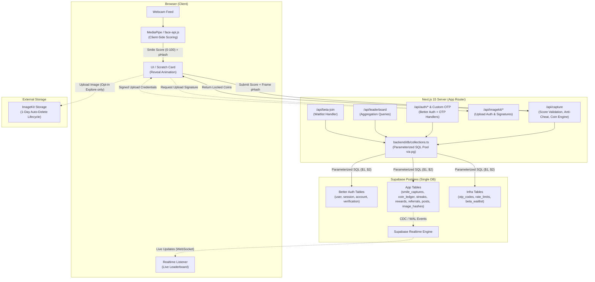
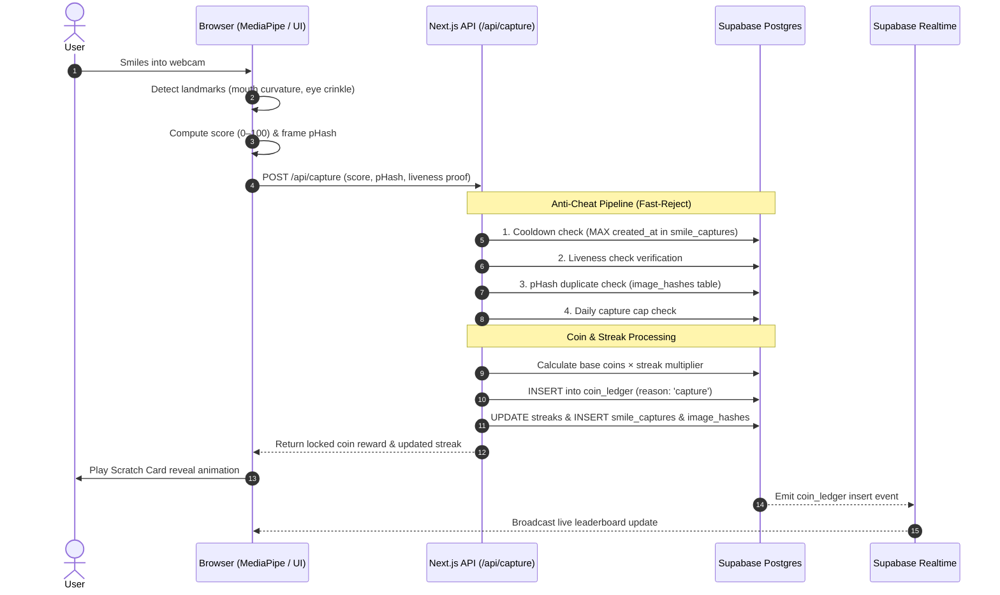
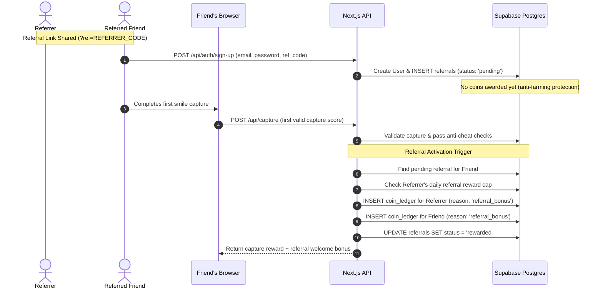

# Architecture — Open Smile

This document describes how Open Smile is put together: system boundaries, data flow, and the reasoning behind the key structural decisions. For conventions and coding rules, see AGENTS.md. For the threat model, see security.md.

## System overview

Open Smile is a single Next.js 15 application (App Router) with no separate backend service. All server-side logic lives in Next.js API routes and server components, talking to one Supabase Postgres database. There is no microservice split — the boundaries that matter here are *client vs. server* and *trusted vs. untrusted computation*, not separate deployable services.

## Why this shape

**Single Next.js app, no separate backend.** The product doesn't need independent scaling of frontend vs. backend, and a hackathon/early-stage timeline favors one deployable unit over service-to-service complexity. Next.js API routes are sufficient for everything here — auth, scoring validation, leaderboard queries.

**One Postgres database, not split by concern.** Auth data (Better Auth's tables), the coin economy, and social/anti-cheat data all live in the same Postgres instance. This is deliberate: the coin ledger needs to join against `user.id` constantly (leaderboards, referral payouts, streak lookups), and splitting auth into a separate store (e.g. keeping Supabase Auth while app data lives elsewhere) would mean syncing user IDs across two systems for no real benefit. See the "Auth Architecture" reasoning below.

**Client-side smile scoring, not server-side.** MediaPipe/face-api.js run in-browser. This is both a cost decision (no server GPU needed) and a privacy decision (raw video frames don't need to leave the device for scoring in most flows). The server's job is to *validate and price* a score, not compute it from raw media.

## Auth architecture

Better Auth owns `user`, `session`, `account`, and `verification` directly in the same Postgres database — it does **not** sit on top of Supabase Auth. In this stack, Supabase is purely Postgres + Realtime + (optionally) Storage; its own Auth product is unused.

- Access is via a raw `pg` connection pool (`backend/db/client.ts`), not an ORM. `backend/db/collections.ts` centralizes typed, parameterized query helpers so SQL isn't scattered through route handlers.
- A custom email-OTP layer sits alongside Better Auth (`otp_codes` table + `send-otp` / `verify-otp` / `check-credentials` / `mark-verified` / `notify-login` routes) for verification and login-notification flows Better Auth doesn't handle out of the box.
- App tables (`smile_captures`, `coin_ledger`, etc.) reference `user.id` as a plain foreign key — one source of truth, no UID-syncing between systems.
- **Known integration seam:** Supabase Realtime's built-in RLS policies expect Supabase Auth JWTs by default. Since auth is Better Auth, per-user Realtime channel authorization (e.g. private leaderboard subscriptions) needs the Better Auth session passed into Realtime's presence/broadcast auth callback manually. This is the one place the "two systems, one database" architecture requires extra wiring, and it should be verified before relying on Realtime for anything access-controlled.

## Data flow: a smile capture, end to end

1. **Client:** webcam frame → MediaPipe/face-api.js landmark detection (in-browser) → smile score (0–100) computed from mouth curvature, width/height ratio, eye crinkle.
2. **Client → Server:** score (and enough metadata for anti-cheat, e.g. a perceptual hash of the frame) is sent to the capture endpoint. The raw image itself only goes to ImageKit if the feature needs persistence (e.g. a potential Explore post) — not to the scoring path.
3. **Server, anti-cheat checks (in order, reject fast):**
   - Cooldown check — `MAX(created_at)` for this user in `smile_captures`, reject if inside the cooldown window.
   - Liveness signal present — reject captures that skipped the liveness check client-side.
   - Perceptual hash check against `image_hashes` for this user — reject near-duplicate/re-photographed images.
   - Daily capture cap check.
4. **Server, coin calculation:** score → base coins, multiplied by current streak multiplier (capped), inserted as a **new row** in `coin_ledger` (never a balance mutation) with `reason: 'capture'`. Streak state (`streaks` table) updated.
5. **Server → Client:** the *already-locked* coin amount is returned. The scratch card is purely a client-side reveal animation over this value — it has no authority over what the reward actually is.
6. **Realtime:** the leaderboard's underlying aggregation reflects the new ledger row; connected clients see the update via Supabase Realtime without polling.

## Data flow: referrals

1. Signup via a referral link records a `referrals` row (`referrer_id`, `referred_id`, `status: 'pending'`).
2. The reward does **not** trigger on signup. It triggers when the referred user completes their first successful capture (i.e. passes the anti-cheat checks above and gets a `coin_ledger` row) — this closes the "create fake accounts for free coins" loophole that a signup-triggered reward would leave open.
3. On trigger: two `coin_ledger` inserts (referrer bonus, referred bonus) with `reason: 'referral_bonus'`, gated by a per-referrer daily cap checked against that day's already-rewarded referrals.

## Storage boundaries

- **Postgres (Supabase):** all structured data — users, sessions, coins, streaks, rewards, referrals, post metadata, likes, OTPs, rate limits. Source of truth for everything transactional.
- **ImageKit:** binary image data only. 1-day auto-delete applies uniformly — captures and Explore posts alike. Postgres never stores image bytes, only `image_url` references.
- **Nothing is cached outside these two stores** at this stage — no separate cache/queue layer yet. If leaderboard aggregation queries become a bottleneck, the planned mitigation is a materialized view or scheduled rollup table in Postgres, not a new caching service, to keep the "one database" property intact.

## Cross-cutting concerns

- **Rate limiting** is DB-backed (`rate_limits` table, windowed counters), not in-memory — this matters specifically because the app deploys to a serverless environment (Vercel) where in-memory state doesn't survive across invocations/cold starts.
- **Expiry/cleanup** (OTPs, rate limit windows) is explicit `DELETE ... WHERE expires_at <= NOW()` logic, run on a schedule, since Postgres has no equivalent to MongoDB's TTL indexes (a leftover consideration from before the Mongo → Postgres migration).
- **No comments in code** — architecture and intent live in these docs (AGENTS.md, security.md, this file), not inline in the codebase, per project convention.

## What's structurally missing

The product's core loop (`/capture`, scratch card, `/leaderboard`, `/explore`, `/rewards`, `/refer`) is not yet scaffolded — everything built so far is auth and infrastructure. Architecturally, none of this requires new services or a stack change; it's new API routes and pages on top of the same Postgres database and the same client-side scoring approach already decided above.

## Deployment note

Supabase free-tier projects auto-pause after 7 days of API inactivity. A scheduled keep-alive ping (e.g. a GitHub Actions cron hitting a lightweight endpoint every 2-3 days) is required to prevent the database going offline between active development/demo sessions.
