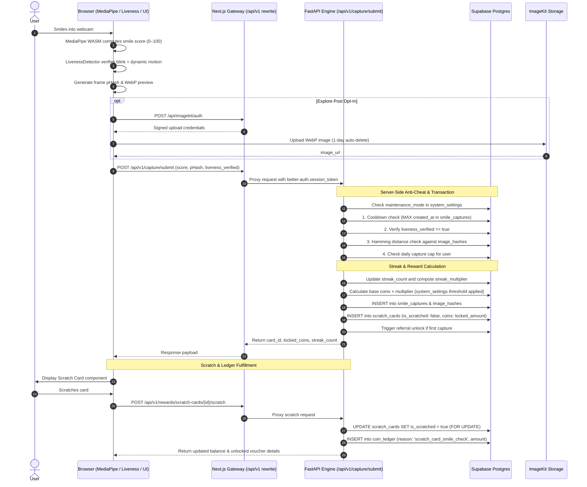
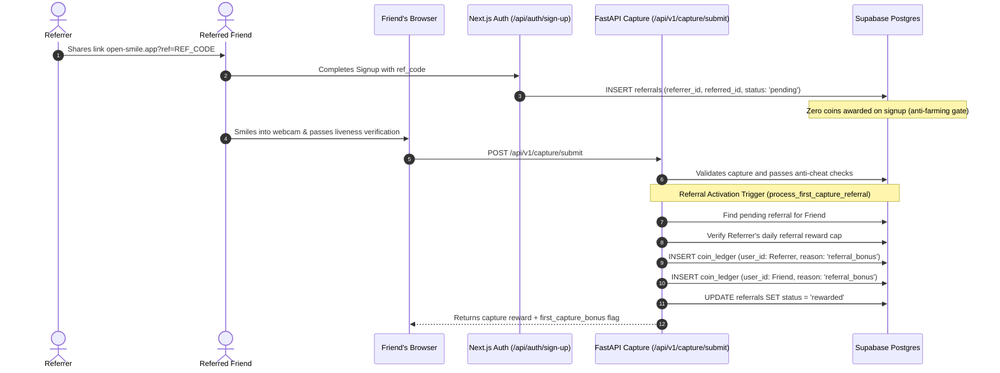

# Architecture — Open Smile

This document describes the end-to-end architecture of Open Smile: system boundaries, data flow, service integration, and the design decisions behind the core loop. For conventions and coding rules, see AGENTS.md. For the threat model and anti-cheat policies, see security.md.

---

## System overview

Open Smile is structured as a high-performance, hybrid web platform combining a **Next.js 15 (App Router)** frontend/BFF with a dedicated **FastAPI (`backend_py/`)** gaming & rewards engine, both sharing a single **Supabase Postgres** instance.

```mermaid
flowchart TB
    subgraph Client["Browser (Client)"]
        Webcam["Webcam Feed"]
        MediaPipe["MediaPipe Face Landmarker<br/>(Client-Side WASM Scoring)"]
        Liveness["Liveness & Anti-Spoofing<br/>(Blink + Dynamic Movement + pHash)"]
        UI["UI / Scratch Cards / Modals<br/>(Neubrutalist Component Tree)"]
        Webcam --> MediaPipe
        MediaPipe --> Liveness
        Liveness -->|"Score (0-100), pHash, Liveness Proof"| UI
    end

    subgraph Gateway["Next.js 15 Gateway (App Router)"]
        Pages["App Pages & RSCs<br/>(/capture, /leaderboard, /rewards, /explore, /refer, /admin)"]
        NextAuth["Better Auth & OTP Handlers<br/>(/api/auth/*)"]
        ImageKitAuth["ImageKit Auth & Upload<br/>(/api/imagekit/*)"]
        AdminAPIs["Admin Management APIs<br/>(/api/admin/*)"]
        NotificationAPIs["User Notifications API<br/>(/api/notifications)"]
        Rewriter["Next.js API Rewriter<br/>(/api/v1/:path* → FastAPI)"]
        NextDBPool["lib/db/client.ts & collections.ts<br/>(Node pg Connection Pool)"]
        
        Pages --> NextDBPool
        NextAuth --> NextDBPool
        AdminAPIs --> NextDBPool
        NotificationAPIs --> NextDBPool
    end

    subgraph FastAPIEngine["FastAPI Engine (backend_py/ /api/index.py)"]
        CaptureAPI["/api/v1/capture<br/>(Anti-Cheat, Cooldowns, Scratch Awarding)"]
        StreakAPI["/api/v1/streaks<br/>(Streak Counting & Multipliers)"]
        RewardAPI["/api/v1/rewards<br/>(Scratch Cards & Voucher Marketplace)"]
        LeaderboardAPI["/api/v1/leaderboard<br/>(Daily/Weekly/Monthly Aggregations)"]
        ReferralAPI["/api/v1/refer<br/>(Referral Attribution & First-Capture Bonus)"]
        ExploreAPI["/api/v1/explore<br/>(Public Feed & Likes)"]
        CronAPI["/api/v1/cron<br/>(Settlements & Auto-Cleanup)"]
        FastAPIDBPool["backend_py/database.py<br/>(asyncpg Connection Pool)"]

        CaptureAPI --> FastAPIDBPool
        StreakAPI --> FastAPIDBPool
        RewardAPI --> FastAPIDBPool
        LeaderboardAPI --> FastAPIDBPool
        ReferralAPI --> FastAPIDBPool
        ExploreAPI --> FastAPIDBPool
        CronAPI --> FastAPIDBPool
    end

    subgraph Database["Supabase Postgres (Unified Single DB)"]
        AuthTables["Auth & User Tables<br/>(user, session, account, verification)"]
        EconomyTables["Economy & Gameplay Tables<br/>(coin_ledger, scratch_cards, smile_captures, streaks, referrals)"]
        RewardTables["Voucher & Marketplace Tables<br/>(vouchers_catalog, claimed_vouchers, leaderboard_settlements)"]
        SocialTables["Social & Anti-Cheat Tables<br/>(explore_posts, explore_likes, image_hashes)"]
        InfraTables["System & Security Tables<br/>(system_settings, otp_codes, rate_limits, notifications, admin_audit_logs)"]
        
        NextDBPool -->|"Parameterized SQL ($1, $2)"| AuthTables
        NextDBPool -->|"Parameterized SQL"| InfraTables
        NextDBPool -->|"Parameterized SQL"| SocialTables
        FastAPIDBPool -->|"Async Parameterized Queries"| EconomyTables
        FastAPIDBPool -->|"Async Parameterized Queries"| RewardTables
        FastAPIDBPool -->|"Async Parameterized Queries"| SocialTables
        FastAPIDBPool -->|"Read Session / User"| AuthTables
    end

    subgraph External["External Cloud Services"]
        ImageKit["ImageKit Storage<br/>(1-Day Auto-Delete Lifecycle)"]
        VercelCron["Vercel Cron Trigger<br/>(Scheduled Midnight Tasks)"]
    end

    UI -->|"Browse & Navigate"| Pages
    UI -->|"Auth Requests & OTP"| NextAuth
    UI -->|"Upload Request"| ImageKitAuth
    ImageKitAuth -.->|"Signed Auth"| UI
    UI -.->|"Upload Photo (Opt-in Explore)"| ImageKit
    UI -->|"Capture, Streaks, Rewards, Feed"| Rewriter
    Rewriter -->|"Proxy to FastAPI"| FastAPIEngine
    VercelCron -->|Trigger /api/cron/*| Next.js Gateway
    Next.js Gateway -->|Invoke /api/v1/cron/*| FastAPIEngine
```

---

## Architectural Decisions & Invariants

1. **Client-side smile scoring, zero server GPU overhead:**
   - MediaPipe Face Landmarker runs in-browser via WebAssembly (`@mediapipe/tasks-vision`).
   - Raw video streams and camera frames **never leave the user's device** during scoring.
   - The server never evaluates raw frames; it validates metadata (liveness proof, pHash, cooldowns, daily caps) and calculates rewards.

2. **One unified Postgres database, zero data-sync microservices:**
   - Auth records (Better Auth's `user`, `session`, `account`), transaction ledgers (`coin_ledger`), and gameplay state all reside in the same Postgres instance.
   - All tables reference `user.id` directly with foreign keys. No asynchronous event buses or user sync queues are needed.

3. **Dual-engine runtime (Next.js + FastAPI):**
   - **Next.js 15 (Node.js)** serves React Server Components, client UI, Better Auth lifecycle, ImageKit signatures, admin dashboards, and notification management.
   - **FastAPI (Python `asyncpg`)** powers the high-throughput mathematical and transactional game loop: anti-cheat validation, streak multipliers, coin calculation, scratch card generation, and leaderboard settlement.
   - Communication is seamless: Next.js rewrites `/api/v1/:path*` to FastAPI, which directly authenticates the incoming `better-auth.session_token` cookie against the Postgres `session` table.

4. **Immutable append-only Coin Ledger (`coin_ledger`):**
   - User coin balances are **never** stored as a mutable running number.
   - Balances are computed via `SUM(coins)` over rows with categorized reasons (`capture`, `scratch_card_*`, `referral_bonus`, `voucher_redemption`, `signup_bonus`).
   - Every credit or debit is an atomic insert, making the economy 100% auditable and tamper-proof.

5. **Scratch card reveal mechanic:**
   - Rather than instantly awarding coins upon camera click, the server returns an **unscratched scratch card** (`scratch_cards` table with `is_scratched: false`).
   - The user interacts with the scratch card component in the UI. Upon completion, a request to `/api/v1/rewards/scratch-cards/{id}/scratch` atomically locks the row, flips `is_scratched: true`, and inserts the credit into `coin_ledger`.

---

## Auth & Session Architecture

Better Auth manages core auth tables directly in Postgres. The authentication and session lifecycle works seamlessly across both Next.js and FastAPI:

- **Next.js:** Better Auth handler at `app/api/auth/[...all]/route.ts` manages credentials, sessions, and cookie issuance.
- **Custom OTP Layer:** Sits alongside Better Auth in `app/api/auth/` (`send-otp`, `verify-otp`, `check-credentials`, `mark-verified`, `notify-login`) storing hashed OTP codes in `otp_codes` with attempt-limiting and strict expiry.
- **FastAPI Authentication Dependency (`backend_py/dependencies.py`):**
  - Extracts `better-auth.session_token` from cookies or `Authorization: Bearer <token>` header.
  - Resolves active sessions via an optimized `asyncpg` query joining `session` and `user` where `expiresAt > NOW()`.
  - Injects `current_user` (`user_id`, `email`, `role`, `referral_code`) into protected router endpoints without requiring external auth tokens.

---

## Data Flow: Smile Capture, Scoring & Reveal



---

## Data Flow: Referral Activation & Economy Protection

To prevent sybil attacks and fake account farming, referral rewards are strictly deferred:



---

## Data Flow: Voucher Marketplace & Redemption

Coins accumulated in `coin_ledger` can be redeemed for real-world rewards:

1. **Voucher Catalog:** Managed in `vouchers_catalog` (brands like Amazon, Flipkart, Swiggy, Apple).
2. **Redemption Request:** Client submits `POST /api/v1/rewards/claim-voucher` with `voucher_id`.
3. **Atomic Balance Verification:**
   - Within an async database transaction, FastAPI verifies `user_balance >= voucher.coins_cost`.
   - Executes `INSERT INTO coin_ledger (user_id, coins: -cost, reason: 'voucher_redemption')`.
   - Creates a secured entry in `claimed_vouchers` with a unique claim code.
4. **Fulfillment:** The generated code is displayed in `voucher-claim-modal.tsx` and retained in user inventory.

---

## Leaderboard Aggregation & Settlement

- **Live Leaderboard (`/api/v1/leaderboard`):**
  - Computes top rankers across **daily**, **weekly**, and **monthly** windows.
  - Aggregates smile scores and capture counts directly from `smile_captures` joined with `user`.
- **Automated Settlement (`/api/cron/leaderboard-settlement` → `/api/v1/cron/leaderboard-settlement`):**
  - Runs nightly at midnight UTC via Vercel Cron.
  - Finalizes top positions in `leaderboard_settlements`.
  - Automatically awards celebratory bonus scratch cards (`scratch_cards` table) to top podium finishers (Rank 1 Gold, Rank 2 Silver, Rank 3 Bronze).

---

## Storage & Privacy Posture

- **Supabase Postgres:** Single source of truth for all structured entities (users, sessions, coin ledger, scratch cards, streaks, vouchers, audit logs).
- **ImageKit:** Binary storage for user uploads (profile photos and opt-in Explore posts).
  - Enforces a strict **1-day auto-delete policy**.
  - Postgres never stores raw image blobs, only signed CDN URLs.
- **Privacy Assurance:** Raw video frames from webcam capture are never transmitted to server endpoints; only derived score metrics and perceptual image hashes (pHash) are submitted.

---

## Cross-Cutting & Infrastructure

1. **Dynamic System Settings (`system_settings`):**
   - Configurable at runtime via `/admin/settings` (maintenance mode, cooldown duration, minimum smile threshold, coin multipliers, daily capture limits).
   - Queried dynamically by both Next.js and FastAPI engines without service restarts.

2. **Automated Crons (`vercel.json`):**
   - `0 0 * * *`: `/api/cron/leaderboard-settlement` (Daily ranking freeze and reward distribution).
   - `0 3 * * *`: `/api/cron/cleanup` (Purges expired OTP codes and stale rate-limit counters).
   - `0 12 * * *`: `/api/cron/keep-alive` (Periodic lightweight query preventing Supabase free-tier database auto-pausing).

3. **Audit Logging & Moderation:**
   - Admin operations (voucher creation, user inspection, post moderation) trigger `logAdminAction()` in `admin_audit_logs`.
   - Explore feed posts are moderated through `app/admin/explore` with immediate hide/delete capabilities.

